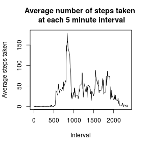
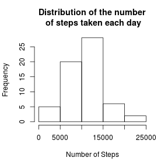
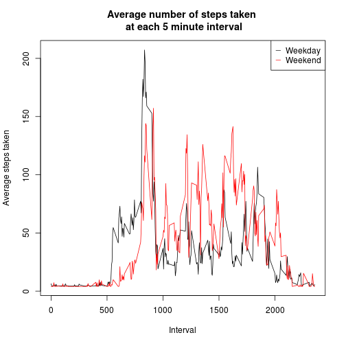

This document provides the code for Project 1 of Reproducible Research.

***

### Loading and formatting data

The following code chunk

1) Loads lubridate for converting date string into Date format.
2) Sets up some options for printing numbers.
2) Loads the csv file 'activity.csv' into R environment into a dataframe named 'df'.
3) converts the column 'date' of 'df' into date format.


```r
library(lubridate)
options(scipen=999, digits = 2)
df<-read.csv('activity.csv')
df$date<-ymd(df$date)
```
***
### Calculate the mean total number of steps taken per day

The following code chunk

1) Uses tapply to sum the number of steps taken each day.
2) Calculates the mean number of steps taken each day.
3) Calculates the median number of steps taken each day.
4) plots a histogram of the number of steps taken each day.


```r
stepsByDay <- tapply(df$steps, df$date, sum)
mean_stepsByDay<-mean(stepsByDay, na.rm=TRUE)
median_stepsByDay<-median(stepsByDay, na.rm=TRUE)
hist(stepsByDay, xlab='Number of Steps', main='Distribution of the number\n of steps taken each day')
```

 

The mean and median of the number of steps taken by day are 10766.19 and 10765, respectively.

***

### What is the average daily activity pattern?

The following code chunk

1) Uses tapply to sum the number of steps taken during each time interval.
2) Calculate the number of days in the set.
5) Averages each interval.
6) Plots the average steps taken during each interval against time.


```r
stepsByInterval <- tapply(df$steps, df$interval, sum, na.rm=TRUE)
numDays<-length(stepsByDay)
interval<-as.numeric(rownames(stepsByInterval))
Ave_stepsByInterval<-stepsByInterval/numDays
plot(interval, Ave_stepsByInterval, type='l', xlab='Interval', ylab='Average steps taken', main='Average number of steps taken \n at each 5 minute interval')
```

 

The interval with the max number of steps taken is 835 with an average of 179.13 steps.

***

### Imputing missing values

The following code chunk

1) Print summary of 'df'.  This shows that 2304 entries in the steps column contain NA.
2) Copies the original dataframe, df, to a new dataframe, newDF. 
3) Calculate the mean value of steps from each interval over all days and store in valNA.
4) Prints the value valNA to be used in place of NA
5) Replaces all NAs with valNA
6) Sums the steps taken each day with 


```r
summary(df)
```

```
##      steps           date               interval   
##  Min.   :  0    Min.   :2012-10-01   Min.   :   0  
##  1st Qu.:  0    1st Qu.:2012-10-16   1st Qu.: 589  
##  Median :  0    Median :2012-10-31   Median :1178  
##  Mean   : 37    Mean   :2012-10-31   Mean   :1178  
##  3rd Qu.: 12    3rd Qu.:2012-11-15   3rd Qu.:1766  
##  Max.   :806    Max.   :2012-11-30   Max.   :2355  
##  NA's   :2304
```

```r
newDF<-df
valNA<-mean(Ave_stepsByInterval, na.rm=TRUE)
valNA
```

```
## [1] 32
```

```r
newDF$steps[is.na(newDF$steps)]<-valNA
impute_stepsByDay <- tapply(newDF$steps, newDF$date, sum)
mean(impute_stepsByDay)
```

```
## [1] 10581
```

```r
median(impute_stepsByDay)
```

```
## [1] 10395
```

```r
hist(impute_stepsByDay, xlab='Number of Steps', main='Distribution of the number\n of steps taken each day')
```

 

The mean (median) when ignoring NAs is 10766.19 (10765), and the mean (median) when imputing the NAs with the average over each interval is 10581.01 (10395).  Essentially, you change the answer when you just make up numbers for no reason.  However, the histograms look the same because the bins are super wide.

***

### Weekday vs. Weekend

The following chunk of code

1) Adds a field containing the day of the week to the dataframe 'newDF'.
2) Subsets newDF into two smaller dataframes containing only entries of weekdays and weekends.
3) As before, calculates the average number of steps in each interval for each subset.
4) Plots the data on the same graph.  I've used the same graph so you can compare the two curves.


```r
newDF$day<-weekdays(newDF$date)
weekend<-subset(newDF, day=='Sunday' | day=='Saturday')
weekday<-subset(newDF, !(day=='Sunday' | day=='Saturday'))

weekend_stepsByInterval <- tapply(weekend$steps, weekend$interval, sum, na.rm=TRUE)
weekend_stepsByDay <- tapply(weekend$steps, weekend$date, sum)
weekend_numDays<-length(weekend_stepsByDay)
weekend_stepsByInterval<-weekend_stepsByInterval/weekend_numDays

weekday_stepsByInterval <- tapply(weekday$steps, weekday$interval, sum, na.rm=TRUE)
weekday_stepsByDay <- tapply(weekday$steps, weekday$date, sum)
weekday_numDays<-length(weekday_stepsByDay)
weekday_stepsByInterval<-weekday_stepsByInterval/weekday_numDays

plot(interval, weekday_stepsByInterval, type='l', xlab='Interval', ylab='Average steps taken', main='Average number of steps taken \n at each 5 minute interval')
lines(interval, weekend_stepsByInterval, col='red')
legend('topright', legend=c('Weekday','Weekend'), pch=c('_', '_'), col=c('black', 'red'))
```

 

